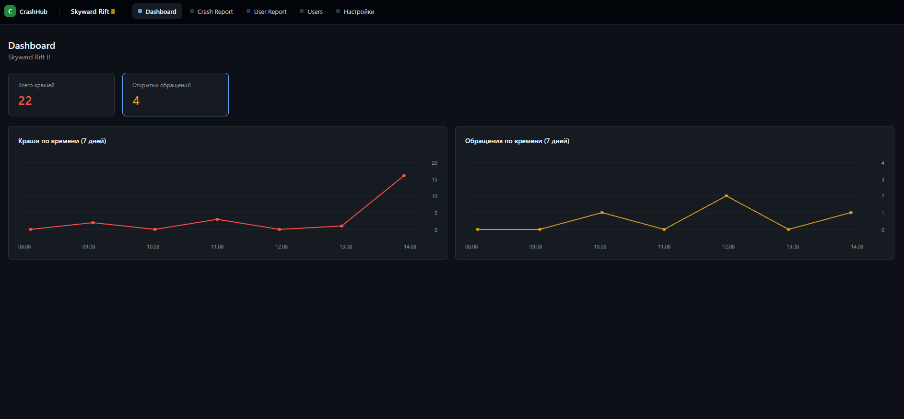
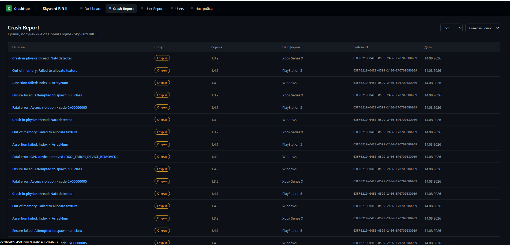
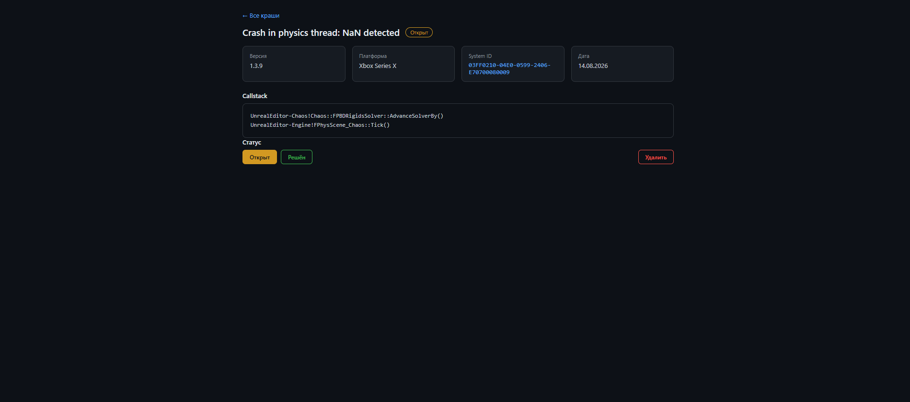
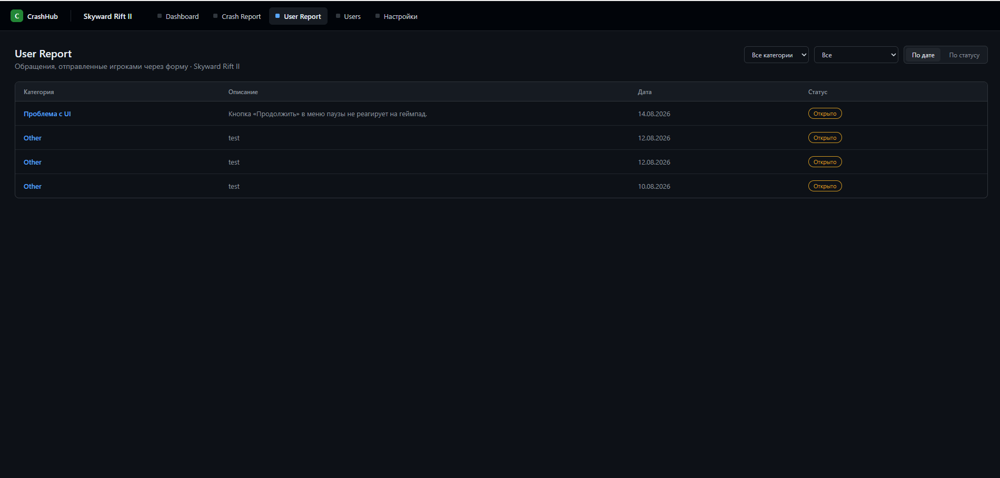
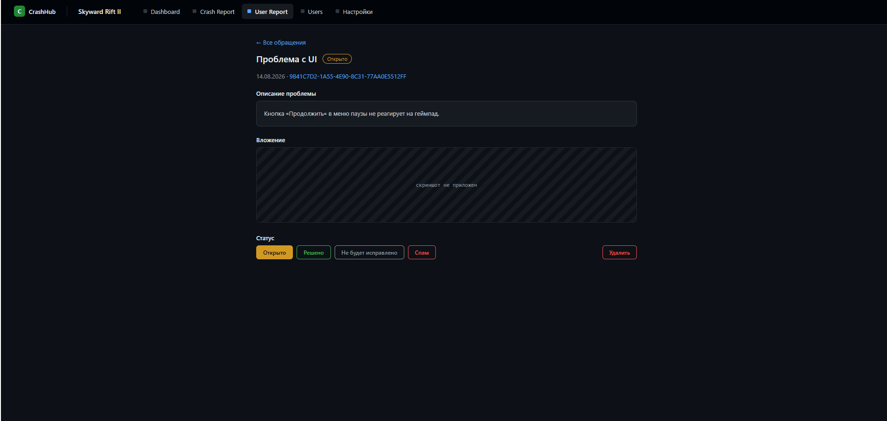
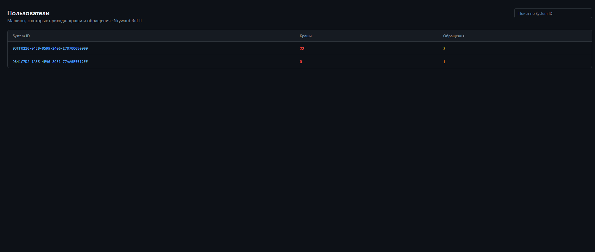

# CrashHub

Self-hosted приём крашей и обращений игроков. Игра шлёт данные обычным HTTP-запросом с JSON, команда разбирает их в веб-панели.

**Подходит любому движку** — Unreal, Unity, Godot, GameMaker, собственный: SDK не нужен, достаточно уметь отправить POST. Справочник запросов — [API.md](API.md).

## Как выглядит

**Dashboard** — сводка по проекту и графики за неделю.



**Crash Report** — краши с фильтром по статусу и сортировкой по дате.



<details>
<summary>Ещё экраны: карточка краша, обращения, пользователи</summary>

**Карточка краша** — версия, платформа, машина, дата, callstack и смена статуса.



**User Report** — обращения игроков с фильтрами по категории и статусу.



**Карточка обращения** — описание, вложение и статусы.



**Пользователи** — машины игроков, их краши и обращения.



</details>

## Возможности

- **Проекты** — по проекту на игру, у каждого свой ключ приложения.
- **Crash Report** — список крашей с фильтром по статусу и сортировкой по дате, карточка с callstack.
- **User Report** — обращения игроков с категориями, статусами, скриншотом и сортировкой по дате или статусу.
- **Пользователи** — машины игроков: конфигурация железа, её краши и обращения.
- **Dashboard** — сводка и графики крашей и обращений за неделю.
- **Роли** — администратор (создаёт проекты и пользователей, удаляет данные) и участник (только смотрит и меняет статусы).

## Стек

ASP.NET Core MVC (.NET 10), EF Core, ASP.NET Core Identity. Никаких внешних зависимостей на фронте — обычные Razor-страницы и немного ванильного JS.

## Запуск

Нужны .NET SDK 10 и SQL Server (подойдёт Express или LocalDB) — про другие базы ниже.

1. Пропишите строку подключения в `CrushHUB/appsettings.json`:

   ```json
   "Project": {
     "Database": {
       "ConnectionString": "Server=localhost;Database=CrushHUB;Trusted_Connection=True;TrustServerCertificate=True;MultipleActiveResultSets=True"
     }
   }
   ```

   Её же можно задать переменной окружения `Project__Database__ConnectionString` — она перекрывает файл.

2. Примените миграции (база создастся сама):

   ```bash
   dotnet ef database update --project CrushHUB/CrushHUB.csproj
   ```

3. Запустите:

   ```bash
   dotnet run --project CrushHUB/CrushHUB.csproj
   ```

Панель откроется на `http://localhost:5045`. Первый вход — логин `admin`, пароль `admin`. **Смените пароль сразу после первого запуска**, эта учётная запись заводится миграцией и одинакова у всех.

## База данных

Из коробки подключён **SQL Server** — под него собраны миграции в `CrushHUB/Migrations`.

Проект работает через EF Core, поэтому переносится на другую базу сменой провайдера:

1. Поставьте пакет нужного провайдера вместо `Microsoft.EntityFrameworkCore.SqlServer`:

   | База | Пакет |
   | --- | --- |
   | PostgreSQL | `Npgsql.EntityFrameworkCore.PostgreSQL` |
   | MySQL / MariaDB | `Pomelo.EntityFrameworkCore.MySql` |
   | SQLite | `Microsoft.EntityFrameworkCore.Sqlite` |

2. Замените одну строку в `Program.cs`:

   ```csharp
   options.UseSqlServer(appConfig.Database.ConnectionString)   // было
   options.UseNpgsql(appConfig.Database.ConnectionString)      // стало
   ```

3. Пересоберите миграции — они привязаны к диалекту базы и от SQL Server не подойдут:

   ```bash
   rm -r CrushHUB/Migrations
   dotnet ef migrations add Initial --project CrushHUB/CrushHUB.csproj
   dotnet ef database update --project CrushHUB/CrushHUB.csproj
   ```

Код приложения при этом не меняется: обращения к данным идут через `IRepository<T>` и не зависят от конкретной базы.

## API приёма данных

Игра общается с сервером обычным HTTP + JSON — примеры запросов, поля, коды ошибок и порядок вызовов вынесены в отдельный файл: **[API.md](API.md)**.

Коротко: ключ проекта передаётся заголовком `X-Api-Key`, базовый адрес — `{сервер}/ingest/{projectId}`, три метода — конфигурация машины (`/users`), краш (`/crashes`) и обращение игрока (`/reports`), плюс `/ping` для проверки ключа.

## Структура

```
CrushHUB/
  Controllers/
    Api/            приём данных от игры
    Admin/          профиль и управление пользователями (partial-части AdminController)
    Home/           проекты и вкладки проекта (partial-части HomeController)
  Domain/           сущности, DbContext, репозитории
  Models/           модели представлений и тела API-запросов
  Services/         ключи, конфигурации машин, хранение скриншотов, роли
  Views/            Razor-страницы и общие каркасы
  wwwroot/          css, js, загруженные скриншоты
```

Загруженные скриншоты (`wwwroot/uploads`) — данные, а не код: в репозиторий они не попадают.

## Лицензия

[MIT](LICENSE) — можно использовать, изменять и распространять, в том числе в коммерческих проектах.
